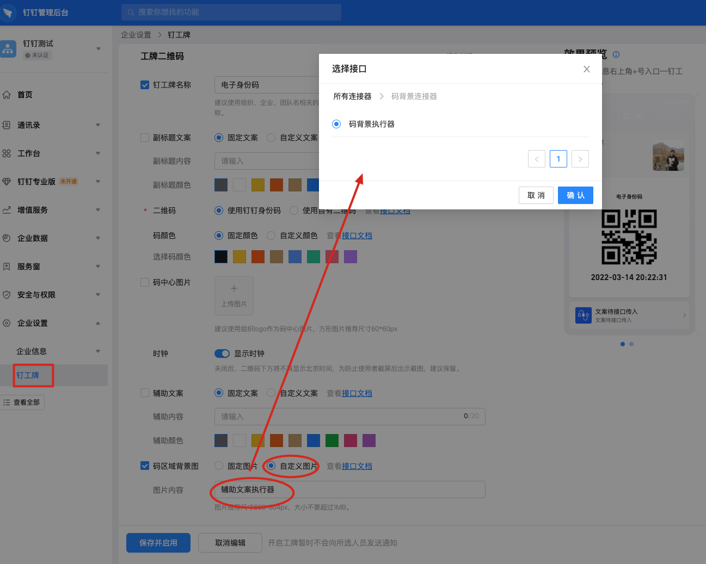
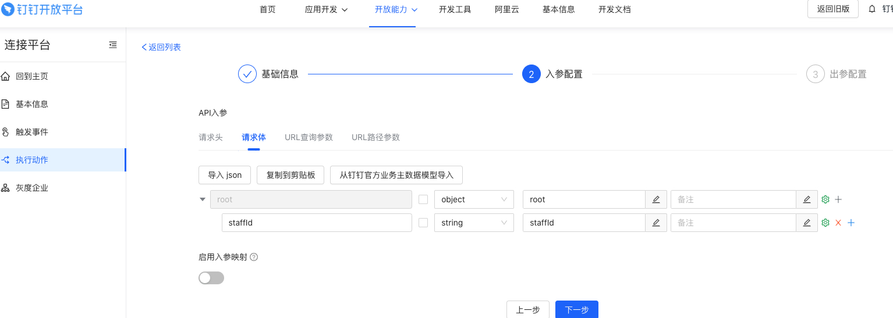
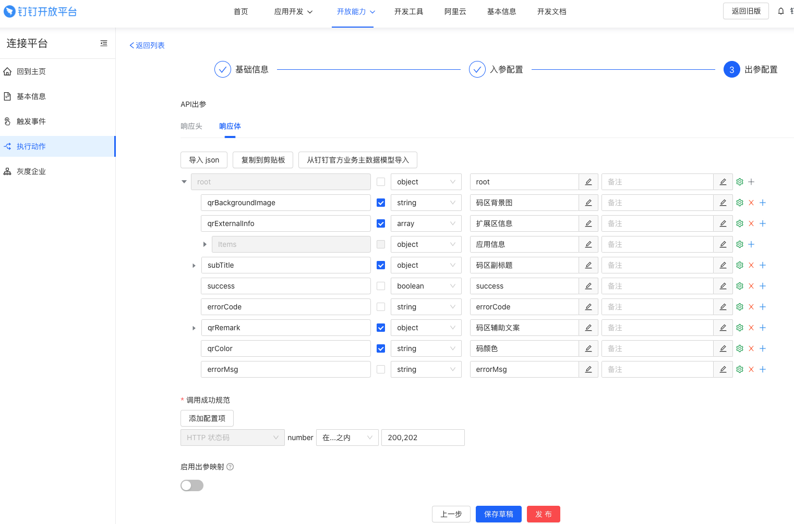
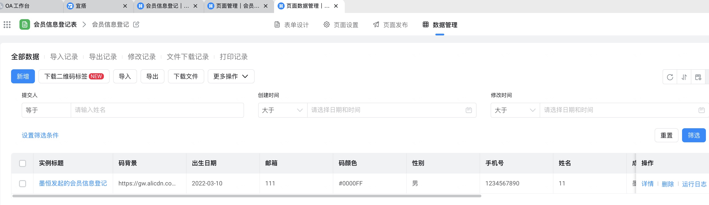
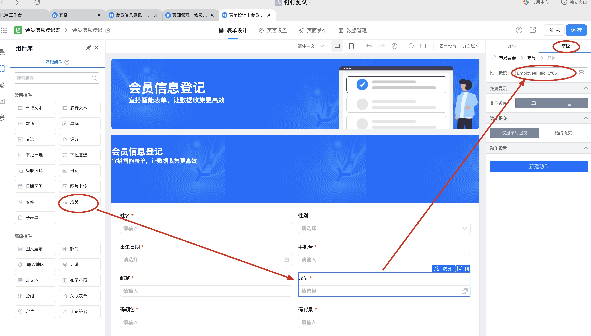
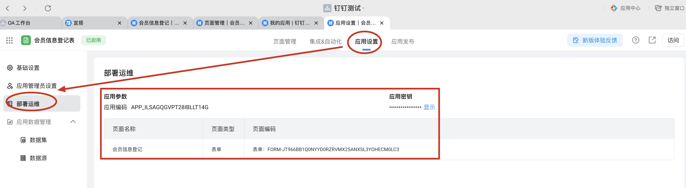
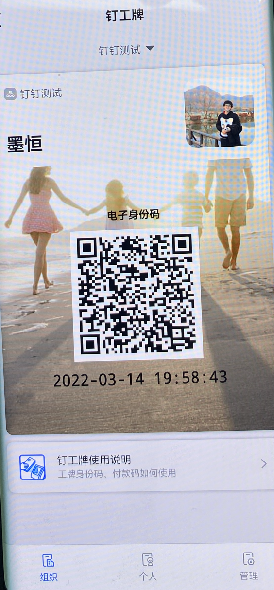

# dingbadge-connector-demo

## 钉工牌简介
钉工牌是企业数字化的标志，是员工的数字化工作证。钉钉基于组织自身的通讯录，联合支付宝和阿里云的支付与安全能力，为企业组织提供一站式的工牌解决方案。

企业可开通钉工牌服务，员工出示钉工牌，不仅能实现物理工牌常有的门禁通行、食堂就餐支付等能力，还能有访客识别、企业协议价支付、员工收款等能力。钉钉聚焦实现用户端钉工牌的展码、解码、支付、安全等能力，在应用场景上与合作伙伴的系统开放共建。

## 接入准备
1. 成为钉钉开发者，详情请参考成为[钉钉开发者](https://developers.dingtalk.com/document/app/become-a-dingtalk-developer?spm=ding_open_doc.document.0.0.65353799BrvFES#topic-2024337)。

2. 根据需求创建对应的应用，详情请参考[应用类型介绍](https://developers.dingtalk.com/document/app/application-types?spm=ding_open_doc.document.0.0.65353799BrvFES#topic-2024338)。

3. 应用创建完成后，根据自身场景添加相应的接口调用权限。

     - 企业内部应用和第三方企业应用

      1. 登录[开发者后台](https://login.dingtalk.com/oauth2/challenge.htm?redirect_uri=https%3A%2F%2Fopen-dev.dingtalk.com%2Fdingtalk_sso_call_back%3Fcontinue%3Dhttps%253A%252F%252Fopen-dev.dingtalk.com%252F%253Fspm%253Dding_open_doc.document.0.0.65353799BrvFES&response_type=code&client_id=dingbakuoyxavyp5ruxw&scope=openid+corpid)，单击进入**应用详情页**。

      2. 单击权限管理，然后搜索**钉工牌**对应的接口权限，单击**申请权限**。

     - 纯ISV身份应用

      1. 登录[开发者后台](https://login.dingtalk.com/oauth2/challenge.htm?redirect_uri=https%3A%2F%2Fopen-dev.dingtalk.com%2Fdingtalk_sso_call_back%3Fcontinue%3Dhttps%253A%252F%252Fopen-dev.dingtalk.com%252F%253Fspm%253Dding_open_doc.document.0.0.65353799BrvFES&response_type=code&client_id=dingbakuoyxavyp5ruxw&scope=openid+corpid)，单击进入应用详情页。

      2. 单击权限管理，然后搜索**付款码**对应的接口权限，单击**申请权限**。

4. 获取接口调用凭证，如何获取不同应用的凭证请参考[访问凭证概述](https://developers.dingtalk.com/document/app/authorization-overview?spm=ding_open_doc.document.0.0.65353799BrvFES#topic-2040646)。
     - 企业内部应用和第三方企业应用，获取**AccessToken**进行接口调用,请[参考](https://developers.dingtalk.com/document/app/obtain-the-access_token-of-an-internal-app)。

     - 纯ISV身份应用，获取**SuiteAccessToken**进行接口调用,请[参考](https://developers.dingtalk.com/document/app/obtains-the-suite_acess_token-of-third-party-enterprise-applications)。

## 钉工牌自定义区域接入
本文介绍如何自定义钉工牌二维码背景图。

操作步骤
1. 登录 [企业管理后台](https://oa.dingtalk.com/?spm=ding_open_doc.document.0.0.46c453a7dHhIV5)。

2. 单击进入钉工牌管理页面。

3. 在工牌设计栏，选择工牌二维码并单击打开。

4. 配置自定义内容，你可以根据自身需求选择使用固定内容或自定义内容。
    * 固定内容：直接传入需要的固定内容说明即可。
    例如：在固定图片填写支持正式员工在指定酒店使用。
    * 自定义内容：选择对应连接器的执行动作即可。

钉工牌连接器的执行动作配置请参考[定制化内容接入流程](https://open.dingtalk.com/document/orgapp-server/dingtalk-badge-qr-code-below-customized-copywriting-interface-description#section-6pu-752-bku)。

5. 配置完成后单击确认生效。

## 定制化内容接口接入流程
本部分介绍了如何使用钉钉连接器配置钉工牌二维码下方自定义文案接口。

1. 登录开发者后台，然后进入连接平台页面。

2. 单击右上角创建连接器，然后填写连接器的基本信息，最后单击确定。

3. 创建完成后进入连接器详情页，然后选择执行动作，最后单击创建执行动作。

4. 根据以下信息创建执行动作。
    * a. 根据以下信息配置执行动作的基础信息，然后单击下一步。
        * 执行动作名称：填写你的执行动作名称。
        * API类型：目前仅支持HTTP。
        * 鉴权方式：选择No Auth，如果你需要使用鉴权可以参考连接器基本概念。
        * 接口路径：填写你的用于修改定制化文案的接口访问路径。
        * 是否加入主数据联盟：选择否。

    * b. 根据以下信息分别配置请求入参和请求出参，配置完成后单击保存完成创建。

请求入参

请求出参

5. 执行动作创建完成之后，依次单击右侧更多 > 调试，即可进行调试。

[定制接口参考文档](https://open.dingtalk.com/document/orgapp-server/dingtalk-badge-qr-code-below-customized-copywriting-interface-description)

## 宜搭配置

宜搭表单如下：

宜搭表单

表单字段设置

宜搭应用设置信息（该信息在工程中需要配置）

## 最终运行效果

钉工牌打开后访问了连接器获取了宜搭表单数据里的码背景字段显示在码背景区域，如下图所示：

